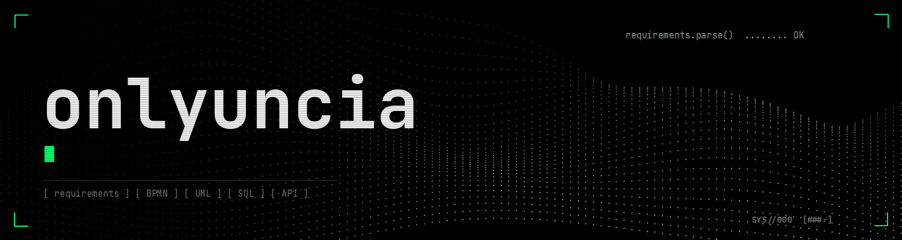

  

---

## `// кто я`

Фулстек-аналитик (БА/СА)

Проектирую цифровые сервисы: разбираю процессы и данные, формулирую требования, описываю взаимодействие систем и довожу решения до понятных команде сценариев и критериев приёмки.

Фокус: процессы · данные · требования · взаимодействие систем · критерии приёмки

---

## `// проект: Grafio`

**Grafio** — аналитический сервис для продавцов маркетплейсов. Проектирование с нуля: от подключения кабинетов и синхронизации данных до раздела РНП с дневными и недельными показателями, товаров, планов и редактируемого дашборда. Отдельно проработал контроль расчётов, роли сотрудников и административный процесс изменения методики.

> [!NOTE]
> В материалах Grafio отдельно обозначено, что реализовано в сервисе, а что представлено как целевое решение и прототип.

### `[+]` Что внутри [репозитория](https://github.com/onlyuncia/grafio-product-docs)

| `ID` Артефакт | `>_` Что там |
|:--|:--|
| `[01]` [Требования](https://github.com/onlyuncia/grafio-product-docs/tree/main/docs/requirements) | Требования и критерии приёмки |
| `[02]` [Архитектура](https://github.com/onlyuncia/grafio-product-docs/tree/main/docs/architecture) | Архитектура и диаграммы |
| `[03]` [Процессы](https://github.com/onlyuncia/grafio-product-docs/blob/main/docs/processes/bpmn-index.md) | BPMN-процессы |
| `[04]` [Данные](https://github.com/onlyuncia/grafio-product-docs/tree/main/docs/data) | Модель данных и описание показателей |
| `[05]` [API](https://github.com/onlyuncia/grafio-product-docs/blob/main/docs/api/openapi.json) | OpenAPI-контракт |
| `[06]` [Прототип](https://github.com/onlyuncia/grafio-product-docs/tree/main/prototype) | Демонстрационный прототип |

---

## `// инструменты`

| `ID` Область | `>_` Инструменты |
|:--|:--|
| `[PM]` Задачи и документация | Jira, Confluence |
| `[BPM]` Моделирование процессов | BPMN 2.0 |
| `[UML]` Диаграммы и архитектура | Use Case, Sequence, C4, draw.io |
| `[DAT]` Данные | SQL (PostgreSQL), Excel / Google Sheets, ERD, модели данных, диаграммы состояний |
| `[API]` API и интеграции | REST / JSON, OpenAPI 3.1, Swagger, Postman, брокеры сообщений (Kafka / RabbitMQ ) |
| `[DES]` Дизайн и схемы | Figma, Miro |
| `[AI]` ИИ | Прототипирование (ChatGPT, Claude, Cursor) |
| `[GIT]` Версионирование | Git, GitHub |

---

<code>// onlyuncia </code>

